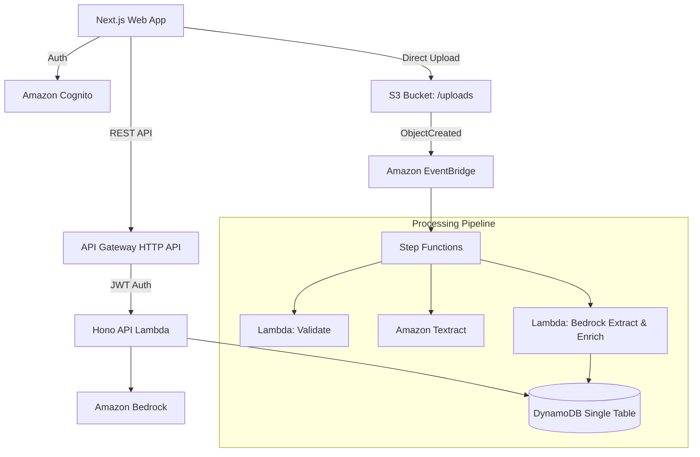

# DukaanOS System Architecture

## Overview

DukaanOS is built on a serverless, event-driven architecture on AWS. It uses an AI-powered data processing pipeline to convert unstructured business documents into a structured business memory graph, which can be queried via natural language.

## High-Level Architecture Diagram

## Core Components

### 1. Frontend (Next.js 14)
- **Deployment:** AWS Amplify Hosting (SSR + Static).
- **Styling:** Tailwind CSS + Radix UI.
- **Data Fetching:** Custom API client fetching from API Gateway.

### 2. API Layer (Hono + Lambda)
- **Framework:** Hono, which provides a fast, edge-compatible router running in a single AWS Lambda function.
- **Routing:** API Gateway HTTP API v2 routes `ANY /api/{proxy+}` to this Lambda.
- **Authentication:** Native JWT Authorizer in API Gateway connected to Cognito.
- **Middleware:** `tenantContext` extracts the tenant ID from the JWT and enforces multi-tenant boundary on every request.

### 3. Asynchronous Document Pipeline
- **Upload:** Clients get a presigned S3 URL and upload directly to S3 (bypassing Lambda payload limits).
- **Trigger:** S3 emits an EventBridge event on `PutObject`.
- **Orchestration:** Step Functions orchestrates the extraction process.
- **OCR:** Textract `AnalyzeExpense` extracts structured fields and line items from invoices.
- **Enrichment:** Claude 3.5 Sonnet normalizes entities, links them, and produces a graph structure.

### 4. Database (DynamoDB Single Table)
- See [DATA_MODEL.md](./DATA_MODEL.md) for access patterns.
- Handles graph relationships via the adjacency list pattern.
- Temporal queries via the `GSI2` index.

### 5. Multi-Agent System
- See [AGENTS.md](./AGENTS.md) for details on the AI agents.
- **Router Agent:** Classifies user intent (Claude Haiku).
- **Domain Agents:** Specialist logic (Memory, Supplier, Warranty) using Claude Sonnet for reasoning.

## Security Boundaries

1. **Tenant Isolation:** Enforced dynamically via the `TENANT#<id>` partition key prefix. The tenant ID is securely injected into the JWT by a Cognito Pre-Token Generation Lambda trigger.
2. **Data Integrity:** Idempotency checks on all writes. Append-only memory for historical facts.
3. **AI Safety:** Agent responses are strictly typed via JSON schemas. Humans must approve external actions.
